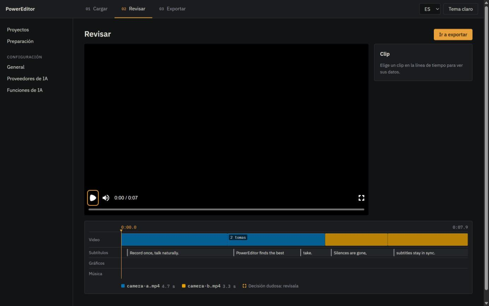
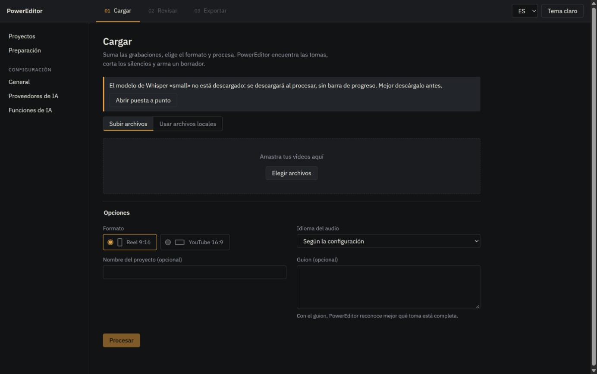
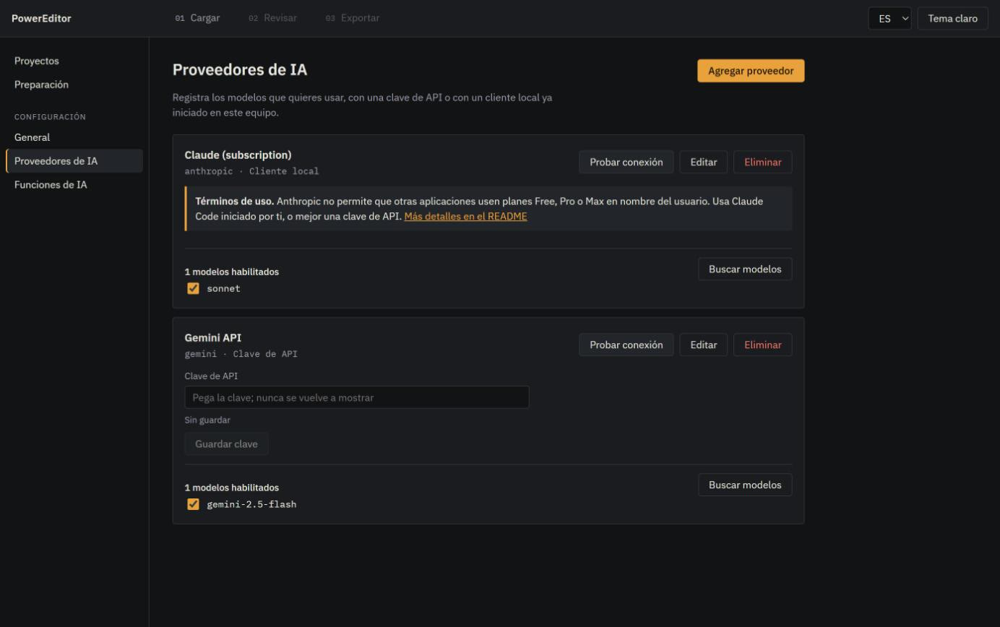
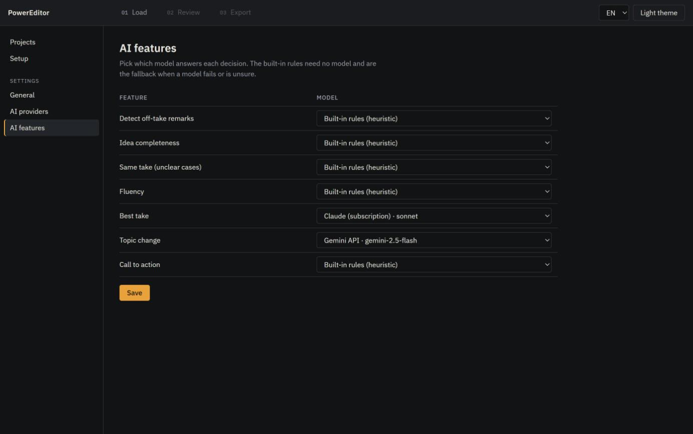
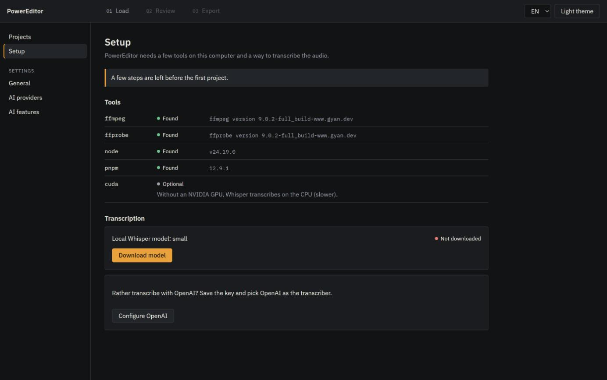

# PowerEditor

Record your video, say the line again when you trip over it, and let PowerEditor do the boring part. It finds every repeated take, keeps the best one, cuts the silences, adds transitions and subtitles, levels the audio, and hands you a finished MP4. You review the result in three steps instead of scrubbing a timeline for an hour.

PowerEditor runs on your own Windows PC. Your footage never leaves it unless you choose a cloud model.

> **Status:** early development. The analysis pipeline and the render engine work today from the command line (Phases 0–3 of [PLAN.md](PLAN.md)). Take selection is heuristic by default; AI models can answer individual decisions from the command line (Phase 4). The local app runs the whole flow without the command line: load recordings, follow the processing, preview the draft, edit it in the review step (switch takes, trim, remove/restore, transitions, subtitles, music and track levels, color, undo/redo, autosave) and export the MP4 (Phases 6–8). Graphics and the installer are planned. Features below are marked **planned** when they do not exist yet.

## Why PowerEditor

Talking-head videos (reels, tutorials, course lessons, YouTube) are cheap to record and expensive to edit. Most of the editing time goes into the same mechanical work: finding the good take, trimming dead air, syncing captions. PowerEditor automates that work with deterministic rules first and AI only where judgment is needed, so it stays fast, cheap and predictable.

- **Less editing time.** Drop in the raw files, get a cut you only need to check.
- **Local first.** Transcription runs on your machine with Whisper by default.
- **No surprise bills.** Heuristics do most of the work; paid models are optional and chosen per feature.
- **What you see is what you export.** The preview and the final render use the same composition.

## Features

| Feature                                                                                                         | Status    |
| --------------------------------------------------------------------------------------------------------------- | --------- |
| Ingest any phone or camera file (VFR to CFR mezzanine, 540p preview proxy)                                      | Available |
| Word-level transcription: local Whisper or OpenAI `whisper-1`                                                   | Available |
| Silence detection and removal (Silero VAD + loudness floor)                                                     | Available |
| Draft project built automatically from the analysis                                                             | Available |
| MP4 render with click-free cuts and -14 LUFS loudness normalization                                             | Available |
| Best-take selection when a phrase was recorded several times (heuristic, or an AI model per feature)            | Available |
| Bring your own AI model per feature: OpenAI, Gemini, Claude, DeepSeek, Jev, by API key or a logged-in local CLI | Available |
| Animated subtitles (karaoke, clean, bold pop, minimal) + SRT/ASS export                                         | Available |
| Automatic transitions (punch-in within a topic, fade or slide between topics)                                   | Available |
| Color matching across sources, presets and sliders                                                              | Available |
| Music with automatic ducking under the voice, per-track volume, matched source loudness                         | Available |
| Titles, lower thirds, logo, progress bar, automatic call-to-action                                              | Planned   |
| 3-step app: Load → Review → Export, with setup, settings, AI providers and features screens                     | Available |
| Editing in the review step: switch take, trim, remove/restore, transitions, subtitle text, undo/redo            | Available |
| Windows installer with automatic updates                                                                        | Planned   |
| FCPXML export for other editors (via OpenTimelineIO)                                                            | Planned   |

## How it works

1. **Ingest.** Each file is probed, converted to a constant-frame-rate master for rendering, a light proxy for preview, and a 16 kHz audio track for analysis.
2. **Transcribe.** Whisper writes down every word with its start and end time, filler words included.
3. **Find speech.** A voice detector marks where you speak; everything else is a candidate cut.
4. **Split into phrases** using pauses and punctuation.
5. **Group repeated takes and pick the best one.** Remarks like "cut, again" are dropped, similar phrases are clustered, and each take is scored in code (completeness, filler words, stutters, pace, loudness, framing). Rejected takes stay in the project as removed clips, so you can swap them back. Semantic questions such as "is this idea complete?" can go to an AI model you choose per feature; an answer below the confidence minimum keeps the heuristic result and flags the decision for review.
6. **Build the draft.** Clips, transitions, subtitles, audio and color go into one `project.json`.
7. **Render.** Remotion draws the video, ffmpeg rebuilds the voice sample by sample so cuts never click, and a final pass normalizes loudness.

## Screenshots

The app runs in your browser against the local PowerEditor server. The interface is in Spanish by default, with English one click away.

**Review.** The timeline shows which source file is used when (one color per file), a badge on clips that have alternative takes, and the subtitle line. The preview player sits above it. Pick a clip to trim it by 0.1 s, change its speed or volume, remove or restore it, or switch to another take (the badge opens the take list; Alt-click cycles takes). Side panels set the transition of each cut or one for all cuts, the subtitle style and text, the audio (voice and music volume, a music file that ducks under speech, matched loudness between recordings) and the color (natural, warm, cool or black-and-white looks, four sliders, for every clip or one clip, and the automatic match between cameras). Every change is undoable (Ctrl+Z / Ctrl+Shift+Z) and saved automatically.



**What comes out.** Frames from a real render of the demo project: karaoke subtitles follow each word, and the cut moves to the second camera on its own.

| Source A, karaoke highlight                                                   | Source B after a cut                                                                |
| ----------------------------------------------------------------------------- | ----------------------------------------------------------------------------------- |
|  |  |

**Load.** Drop the recordings, pick Reel or YouTube format, optionally paste the script, and press Process.



**Choose the model for each decision.** Register providers with an API key or a local subscription client, then pick which model answers each AI feature. Anything left on "built-in rules" never leaves your PC.

| AI providers                                        | AI features                                       |
| --------------------------------------------------- | ------------------------------------------------- |
|  |  |

**First run.** A checklist tells you what is missing and downloads the Whisper model for you.



_The screenshots use synthetic test footage (color bars) generated for the demo._

## Requirements

- Windows 10/11 (x64 or ARM64). CI also runs the test suite on Linux.
- [uv](https://docs.astral.sh/uv/) (installs Python 3.12 for you).
- Node.js 24 with Corepack (ships with Node 24).
- FFmpeg and ffprobe 7.0 or newer on `PATH`, or set their paths in settings.
- On Windows ARM64, rendering needs an x64 Node.js build (set its path as `nodePath` in settings); Remotion has no ARM64 Windows compositor.
- Optional: an NVIDIA GPU with CUDA 12 + cuDNN 9 for faster transcription. Without a GPU, Whisper runs on the CPU with the `small` model.

## Quick start (developers)

```bash
# Backend
cd backend
uv sync
uv run powereditor doctor          # checks ffmpeg, ffprobe, node, pnpm, cuda

# Composition (from the repo root)
cd ..
corepack pnpm install

# Build the web app once, then open it in the browser
corepack pnpm --filter @powereditor/web build
cd backend
uv run powereditor serve --open

# Or from the command line: analyze a recording into a draft project, then render it
uv run powereditor analyze path/to/video.mp4 --project-id demo
uv run powereditor render demo     # writes <data dir>/projects/demo/exports/final.mp4
```

`analyze` downloads the Whisper model on first use; pass `--script script.txt` to judge take completeness against your script. Other commands: `ingest`, `transcribe`, `eval-takes` (take-choice accuracy on the benchmark), `providers list` and `features` (registered models and which one answers each feature), `serve` (local API on `127.0.0.1:8765`). Run `uv run powereditor --help` for the full list.

## Configuration

You should never need to edit a file to configure PowerEditor.

- **Settings** (transcriber, Whisper model and device, language, silence padding, loudness target, tool paths) are stored in `settings.json` inside the user data dir: `%LOCALAPPDATA%\PowerEditor` on Windows. Set them in the app under **Configuración › General** (or through `PATCH /api/settings`).
- **API keys** are stored in the OS keyring (Windows Credential Locker), never in plain files.
- **`.env`** is a developer override only. The accepted variables are the fields of `Settings` in `backend/powereditor/config.py`; `.env.example` is the template.
- `POWEREDITOR_DATA_DIR` moves the data dir (projects, models, downloaded binaries, logs, settings).

## Privacy

- Video, audio and transcripts stay on your machine. Projects live in your user data dir.
- Whisper runs locally by default. Audio is sent to OpenAI only if you pick the `openai` transcriber.
- AI decision features are off by default (the heuristic engine needs no model). A feature you assign to a cloud model sends it only the minimal text its question needs (one segment, or the takes of one group).

## Subscriptions and terms of use

Each AI provider's own terms apply to how PowerEditor reaches it. Check them before you assign a feature:

- **Claude:** PowerEditor never handles Claude sign-in. Use an Anthropic API key, or the official Claude Code CLI signed in by you. Anthropic does not let third-party apps route requests through Free, Pro or Max plan credentials on their users' behalf, and plan limits assume ordinary individual use ([Claude Code legal and compliance](https://code.claude.com/docs/en/legal-and-compliance)). An API key is the safe choice for PowerEditor.
- **Gemini CLI:** signing in with a personal Google account has a free quota of 1000 model requests per user per day ([Gemini CLI quotas](https://geminicli.com/docs/resources/quota-and-pricing/)). A long recording can use many requests.
- **Codex CLI:** usage counts against your ChatGPT plan's limits and OpenAI's terms ([Codex pricing](https://learn.chatgpt.com/docs/pricing)).

## Licenses to know about

- **Remotion** is free for individuals and companies of up to 3 people. Larger teams need a [Remotion company license](https://www.remotion.dev/license).
- **FFmpeg** is not bundled. Popular Windows builds (for example gyan.dev `full_build`) are GPL; the packaged app will use an LGPL build or download FFmpeg at first run.

---

## For AI agents

Dense reference for coding agents. Read this before exploring; it should save most of the discovery work.

### Repo map

| Path                                           | Responsibility                                                                                                                                                                                                                                                                                                              |
| ---------------------------------------------- | --------------------------------------------------------------------------------------------------------------------------------------------------------------------------------------------------------------------------------------------------------------------------------------------------------------------------- |
| `backend/powereditor/cli.py`                   | Typer CLI: `doctor`, `serve` (`--open`, `--dev`), `ingest`, `transcribe`, `analyze`, `render`, `export-subtitles`, `eval-takes`, `providers list`, `features`                                                                                                                                                               |
| `backend/powereditor/api/`                     | FastAPI app (`app.py`: health, doctor, web app with SPA fallback, dev CORS); `origin_guard.py` (Host and Origin checks); routes for settings/secrets, providers, projects, jobs (+ WebSocket), media, music upload (`routes_audio.py`), setup; `services.py` holds the injectable pipelines                                 |
| `backend/powereditor/projects.py`              | `ProjectStore`: project folders, `meta.json`, status, ETag-guarded `project.json` writes                                                                                                                                                                                                                                    |
| `backend/powereditor/jobs.py`                  | `JobManager`: thread-pool jobs, one active per project, throttled progress events, cooperative cancel, bounded shutdown                                                                                                                                                                                                     |
| `backend/powereditor/process.py`               | `kill_tree`, `ProcessScope` / `tracked()`: a cancelled job kills its ffmpeg and Remotion process trees                                                                                                                                                                                                                      |
| `backend/powereditor/models.py`                | Pydantic models, single source of truth for `project.json` and stage results                                                                                                                                                                                                                                                |
| `backend/powereditor/schema_gen.py`            | Writes `packages/composition/schema/project.schema.json` from `Project`                                                                                                                                                                                                                                                     |
| `backend/powereditor/config.py`                | `.env` developer overrides (pydantic-settings), `REPO_ROOT`                                                                                                                                                                                                                                                                 |
| `backend/powereditor/settings_store.py`        | Settings layering, user `settings.json`, keyring and in-memory secret stores                                                                                                                                                                                                                                                |
| `backend/powereditor/paths.py`                 | User data dir layout, executable resolution (configured → `<data dir>/bin` → `PATH`)                                                                                                                                                                                                                                        |
| `backend/powereditor/doctor.py`                | Dependency probes                                                                                                                                                                                                                                                                                                           |
| `backend/powereditor/timeline.py`              | Clip frame layout; mirrored by `packages/composition/src/timeline.ts`                                                                                                                                                                                                                                                       |
| `backend/powereditor/pipeline/`                | Stage runner + cache (`runner.py`), ffmpeg helpers, ingest, transcription, VAD, segmentation, loudness, color stats, color match between sources (`color_match.py`), takes, draft builder, `analyze.py`                                                                                                                     |
| `backend/powereditor/providers/`               | `ModelProvider` contract (`base.py`), settings types and base-URL trust (`config.py`), `registry.py`, typed questions (`questions.py`), Jev (`jev.py`), API adapters (`api/`), local CLI adapters (`local_cli/`)                                                                                                            |
| `backend/powereditor/decide/`                  | `DecisionEngine` protocol (`base.py`), `HeuristicEngine`, feature prompts (`prompts.py`), per-feature `ModelDecisionEngine` (`model_engine.py`), `create_engine` factory                                                                                                                                                    |
| `backend/powereditor/eval/takes_eval.py`       | Take benchmark evaluator behind `powereditor eval-takes`                                                                                                                                                                                                                                                                    |
| `backend/powereditor/transcribe/`              | `Transcriber` protocol, factory, faster-whisper and OpenAI implementations                                                                                                                                                                                                                                                  |
| `backend/powereditor/render/`                  | Render job: voice rebuild (`audio_mix.py`), music mix (`music_mix.py`) with the ducking envelope (`ducking.py`), Remotion runner, Node resolution, loopback media server, final pass                                                                                                                                        |
| `backend/powereditor/export/subtitles.py`      | Subtitle remap (source → timeline words), `rebuild_subtitles`, text edits (`retime_words`, `edit_subtitle_text`), line grouping                                                                                                                                                                                             |
| `backend/powereditor/export/subtitle_files.py` | SRT and ASS writers (ASS `\k` karaoke tags for `karaoke_highlight`) behind `powereditor export-subtitles`                                                                                                                                                                                                                   |
| `backend/powereditor/export/otio_export.py`    | OpenTimelineIO → FCPXML / `.otio` (optional `nle` extra)                                                                                                                                                                                                                                                                    |
| `backend/tests/`                               | pytest suite; `conftest.py` isolates data dir, env and secrets; `media.py` builds lavfi fixtures                                                                                                                                                                                                                            |
| `packages/composition/src/`                    | Remotion composition (`ProjectVideo.tsx`, `Root.tsx`, `timeline.ts`, clips, `transitions/` (`transitionStyle`, `ClipTransition`), `subtitles/` (`remapWords`, `groupLines`, presets, bundled Inter font), `audio/` (preview ducking and voice gains, `Music`), `color/` (`feColorMatrix` builder, `ColorGraded`), overlays) |
| `packages/composition/scripts/`                | `gen-types.mjs` (schema → TS), `render.mjs` (CLI render, NDJSON progress)                                                                                                                                                                                                                                                   |
| `packages/composition/test/`                   | vitest                                                                                                                                                                                                                                                                                                                      |
| `PLAN.md`                                      | Product plan, architecture, phases                                                                                                                                                                                                                                                                                          |
| `odd/tasks/powereditor-app.md`                 | Progress log, decisions, measurements, review history                                                                                                                                                                                                                                                                       |
| `web/src/`                                     | React UI (Vite): `App.tsx` (screens), `routes.ts` (`/load`, `/projects/<id>/load                                                                                                                                                                                                                                            | review | export`), `steps/`(Load with upload progress and stage list, Export with render, subtitles and exports list),`review/` (`ReviewStep`with`@remotion/player`, `PreviewVideo`on proxies,`Timeline`, pure `timelineModel`), `jobs/`(job event reducer,`useJob`, stage list), `shell/`(header with steps, sidebar, projects home),`settings/`(Setup, General, Providers, Features screens + pure form logic),`api/`(typed client, error mapping, job WebSocket with polling fallback, XHR upload),`store/`(zustand;`project.ts`with zundo for Phase 7),`i18n/` (`es.json`, `en.json`), `ui/`(form primitives,`useResource`) |
| `web/test/`                                    | vitest + Testing Library (jsdom): API client, i18n key parity, reducers and view models, screens with a mocked `api` and Player; `test/stubs/fonts.ts` replaces `@remotion/fonts`                                                                                                                                           |

### Data flow

```
files → ingest (mezzanine, proxy, WAV) → transcribe → vad → segmentation
      → loudness + color stats → takes → draft_builder → <data dir>/projects/<id>/project.json
project.json → render/job.py:
   audio_mix (ffmpeg voice rebuild) → music_mix (only with a music track)
   → remotion_render (muted MP4 via render.mjs) → final_pass (mux + two-pass loudnorm)
   → exports/<name>.mp4
```

Per-project layout (`ProjectLayout` in `pipeline/runner.py`): `meta.json` (name, creation time, source paths, analyze options), `sources/` (uploaded originals; files added by path are read where they are), `media/`, `cache/<stage>.json`, `cache/model_usage.json` (model calls and tokens per feature of the last takes computation that called a model), `project.json`, `exports/`.

### Source of truth and generated files

1. Edit models in `backend/powereditor/models.py`.
2. `cd backend && uv run python -m powereditor.schema_gen` regenerates `packages/composition/schema/project.schema.json`.
3. `corepack pnpm --filter @powereditor/composition gen:types` regenerates `packages/composition/src/types.generated.ts`.
4. Check freshness with `uv run python -m powereditor.schema_gen --check` and `corepack pnpm -r check:types`.

Never hand-edit the schema or `types.generated.ts`. Both are in `.prettierignore`.

### Local API

`powereditor serve` listens on `127.0.0.1:8765`. The API is under `/api`; the built web app (`web/dist`, or `POWEREDITOR_WEB_DIR`) is served at `/` with an `index.html` fallback for client routes. `--dev` (env `POWEREDITOR_DEV_CORS=1`) allows CORS from the Vite dev server `http://localhost:5173` only. Route errors carry `detail: {code, message}`; validation errors carry `detail: [{loc, msg, type}]`.

Other web pages can reach `127.0.0.1`, so `LocalOriginGuard` (`api/origin_guard.py`) answers only a `Host` of `127.0.0.1`, `localhost` or `[::1]` on the server's own port (DNS rebinding), and refuses POST/PUT/PATCH/DELETE and WebSocket upgrades whose `Origin` is another site (`403 forbidden_host` / `forbidden_origin`; a WebSocket is closed before the handshake). Requests without `Origin` (curl, the CLI) pass. The Vite origin is accepted only with `--dev`. Tests use `tests/api_client.local_client` (base URL `http://127.0.0.1:8765`) and `LOCAL_WS_URL` for WebSockets.

| Route                                                                                                | Purpose                                                                                                                                                                                                                                                                |
| ---------------------------------------------------------------------------------------------------- | ---------------------------------------------------------------------------------------------------------------------------------------------------------------------------------------------------------------------------------------------------------------------- |
| `GET /api/health`, `GET /api/doctor`                                                                 | Version; dependency probes                                                                                                                                                                                                                                             |
| `GET /api/setup`, `POST /api/setup/whisper-model`                                                    | First-run checklist (doctor, transcriber ready, model downloaded, OpenAI key set); download the Whisper model as a job                                                                                                                                                 |
| `GET/PATCH /api/settings`, `PUT/DELETE /api/secrets/{name}`                                          | Settings and secrets (see Configuration)                                                                                                                                                                                                                               |
| `/api/providers*`, `/api/features/models`                                                            | Model providers and per-feature assignment                                                                                                                                                                                                                             |
| `POST /api/projects` `{paths, name?, preset?, language?, script?}`                                   | Create from local files, read in place; `201 {id}`                                                                                                                                                                                                                     |
| `POST /api/projects/upload` (multipart `files` plus the same options as form fields)                 | Create from uploads, copied in chunks to `sources/`                                                                                                                                                                                                                    |
| `GET /api/projects`                                                                                  | List with status (`created`, `ingested`, `analyzed`), duration, `thumbnailUrl`, `activeJobId`, `activeJobKind`, `lastError`                                                                                                                                            |
| `GET /api/projects/{id}`, `GET /api/projects/{id}/meta`                                              | `project.json` with an `ETag` (409 before analysis); creation metadata                                                                                                                                                                                                 |
| `PUT /api/projects/{id}` with `If-Match: <ETag>`                                                     | Save an edited project; 409 on a stale ETag or during analysis, 428 without `If-Match`                                                                                                                                                                                 |
| `DELETE /api/projects/{id}`                                                                          | Delete; 409 while a job runs                                                                                                                                                                                                                                           |
| `POST .../subtitles/rebuild`, `PUT .../subtitles/text` `{fromIndex, toIndex, text}`                  | `rebuild_subtitles` after clip edits; `edit_subtitle_text` on `subtitles.words[fromIndex:toIndex]`                                                                                                                                                                     |
| `POST .../analyze`, `POST .../render` `{exportName?}`, `POST .../export/subtitles` `{format, name?}` | Start a job, `202` with the job; 409 `job_active` when the project already runs one                                                                                                                                                                                    |
| `GET /api/jobs/{jobId}`, `POST /api/jobs/{jobId}/cancel`                                             | Job state (`queued`, `running`, `succeeded`, `failed`, `cancelled`; `error.code`, `result`); cancel                                                                                                                                                                    |
| `WS /api/jobs/{jobId}/events`                                                                        | The current state, then `{jobId, stage, fraction, message, status, error, result}` until a terminal status                                                                                                                                                             |
| `POST /api/projects/{id}/music` (multipart `file`)                                                   | Store an audio file as `media/music-<hex>.<ext>` and probe it: `201 {fileName, durationSeconds, url}`, 422 `unsupported_music_type` or `invalid_music`. Putting it on the timeline is a project edit: an `AudioTrack` of kind `music` whose `sourcePath` is `fileName` |
| `GET/HEAD /api/projects/{id}/media/{file}`                                                           | Files of `media/`, then `exports/`, with HTTP Range (206, 416); hidden and `.part.` files are never served                                                                                                                                                             |
| `GET .../exports`, `POST .../exports/{file}/reveal`                                                  | Export list; show the file in Explorer (501 on other systems)                                                                                                                                                                                                          |

A save, a subtitle edit and the start of an analysis hold the project lock (`ProjectStore.locked`), so an analysis cannot start between a save's check and its write. Jobs run on a two-thread pool (`jobs.py`) and fail with the pipeline's error codes (`missing_openai_key`, `ffmpeg_failed`, `empty_timeline`, `render_timeout`, ...). Cancel is cooperative: the next progress report raises, and `ProcessScope` kills the ffmpeg and Remotion trees registered with `tracked()`. Wrap any new long-running subprocess the same way. Tests inject `Pipelines` (fake analyze, render and Whisper downloader) and a revealer into `create_app`.

### Key contracts

- **Frame rounding:** clip frames = `round((outSec - inSec) / speed * fps)`, ties to even. Python `round()` in `timeline.py`, `roundHalfEven` in `timeline.ts`. Change both or neither.
- **Subtitles:** `project.subtitles.sourceWords` (words per source id, in source seconds) is the source of truth; `subtitles.words` (timeline frames, `clipId`, `wordIndex`) is derived. A word belongs to the clip of its source that overlaps it most, removed clips included, so words of an unchosen take are dropped; it is clamped to that clip and rounded like clip frames. Call `export.subtitles.rebuild_subtitles(project)` after every clip edit (speed, trim, take switch, removal); the web editor does the same locally with `remapWords`, and `editSubtitleText`/`retimeWords` mirror the backend text edit; the composition remaps live with `remapWords` and only falls back to `subtitles.words` when `sourceWords` is empty. Text edits go into `sourceWords` (`edit_subtitle_text`): same word count keeps each word's timing, otherwise the span is split by character length. Lines (`group_lines` / `groupLines`) break at `maxWordsPerLine`, at a cut between clips, at a 0.4 s pause and after `.!?…`, and hold 0.5 s. The shared fixture `packages/composition/test/fixtures/subtitles.json` pins remap, lines and a text edit (`textEdit`) on both sides.
- **Transitions:** never overlap clips, so the timeline length stays the sum of clip frames and the rebuilt voice stays aligned. `punch_in` scales the whole clip by `punchInScale` (user setting `punchInScale`, passed as a render prop), `fade` rises from black and `slide` enters from the right over `durationFrames` at the clip start (`transitions/transitionStyle.ts`). The takes stage sets them: a topic change (`DecisionEngine.transition_between`; heuristic: new source file → `slide`, pause ≥ 2 s before the next segment, or ≥ 1 s plus no shared content word → `fade`) resets the zoom, and the cuts inside a block alternate `cut` / `punch_in`. Fades and slides last 0.3 s; cuts and punch-ins are instant.
- **Audio:** Remotion renders **muted** video; the export's audio is built by ffmpeg and is authoritative. The voice is rebuilt in `render/audio_mix.py` (atrim/atempo/afade/concat, cumulative frame→sample boundaries, batches of `BATCH_CLIPS = 40` via filter script files to respect the Windows 32767-char command line). Each clip's gain is its volume × the voice track's volume × (with `project.normalizeSources`) a per-source gain toward the mean loudness of the audible sources, capped at ±12 dB (`source_gains_db`). With a music track, `render/music_mix.py` loops the file (`-stream_loop -1`), trims it to the voice's exact sample count, fades it in (1 s) and out (2 s), applies its volume × the ducking envelope and adds it with `amix=normalize=0:duration=first`; the final pass normalizes the mix.
- **Ducking:** a deterministic envelope, not a compressor. Speech is the timeline words (`subtitles.words`) merged across gaps under 0.55 s; the music drops by `AudioTrack.duckingDb` with a 0.15 s attack before a word and a 0.4 s release after it (`render/ducking.py`, an ffmpeg `volume` expression evaluated every 256 samples). The Player plays the same envelope per frame through `<Audio volume>` (`packages/composition/src/audio/`; the `previewMusic` prop is true only in the Player). `packages/composition/test/fixtures/audio.json` pins both sides.
- **Color:** one SVG `feColorMatrix` per clip (`packages/composition/src/color/matrix.ts`, `color-interpolation-filters: sRGB`), so the Player and the render show the same picture. Order: the source's `colorCorrection` (per-channel gains), then the global `colorGrade` with the clip's `colorOverride` merged over it (brightness, contrast around mid grey, Rec. 709 saturation, temperature as ±20 % red/blue at ±1). Presets are value sets (`PRESET_VALUES`); sliders keep the preset label. `colorCorrection` is computed when the draft is built (`pipeline/color_match.py`): gains that move each source's mean RGB to the mean of all sources, capped at 1.5× / 0.67×, `None` under 1 %. An identity matrix adds no filter.
- **Stage cache:** `run_stage()` keys on SHA-256 of stage name, stage version, input identities (path + size + SHA-256 if ≤ 1 MiB, else mtime) and params. The record is deleted before computing and written only after declared outputs exist, are non-empty and validate. Bump the stage version when its logic changes.
- **Composition id:** single source `packages/composition/src/composition.json`.
- **Secrets:** API responses report `set`/`source`, never values. Validation errors strip the `input` field. Provider API keys live in the secret store as `provider:<id>:api_key`, never in `settings.json`.

### Conventions

- English everywhere: docs, code, comments, commits (Conventional Commits). Tidy, readable code.
- Python: strict mypy, ruff, Pydantic `CamelModel` (camelCase aliases, `extra="forbid"`).
- `subprocess` with argument lists only, never `shell=True`.
- Node tooling only through `corepack pnpm`.
- Tests: `conftest.py` sets `POWEREDITOR_DATA_DIR` to a temp dir, clears env overrides and swaps the keyring for `InMemorySecretStore`. Markers: `ffmpeg` (needs ffmpeg/ffprobe, skipped when missing), `slow` (model downloads, deselected by default; run with `-m slow`).

### Checks

Run from `backend/`:

```bash
uv run ruff check .
uv run ruff format --check .
uv run mypy powereditor tests
uv run python -m powereditor.schema_gen --check
uv run pytest -q
```

Run from the repo root:

```bash
corepack pnpm install --frozen-lockfile
corepack pnpm typecheck
corepack pnpm lint
corepack pnpm -r test
corepack pnpm -r check:types
corepack pnpm --filter @powereditor/web build
corepack pnpm format:check
```

CI (`.github/workflows/ci.yml`) runs the same commands on Windows and Linux.

### How to extend

- **Web app (dev):** run `uv run powereditor serve --dev` in `backend/` and `corepack pnpm --filter @powereditor/web dev` at the root, then open `http://localhost:5173`. Vite proxies `/api` (and the job WebSocket) to `127.0.0.1:8765`; without `--dev` the backend refuses the Vite origin. `corepack pnpm --filter @powereditor/web build` writes `web/dist`, which `serve` hosts.
- **Screen:** add a component under `web/src/settings/`, `shell/` or `steps/`, a route in `web/src/routes.ts`, a `case` in `screenFor()` in `web/src/App.tsx`, and a sidebar entry in `NAV` (`shell/AppShell.tsx`). Follow a job with `useJob(jobId, onEnd)` and show it with `<JobStages>`; `watchJob` falls back to polling `GET /api/jobs/{id}` when the WebSocket drops. Load data with `useResource(useCallback(() => api.x(), []))`; add the call to `api/endpoints.ts` and its types to `api/types.ts`. Show failures with `<ErrorNotice error={...} />`. Keep decisions in pure functions next to the screen (see `providerForm.ts`) and test them directly; render-test the screen with `vi.mock("../src/api/endpoints")`.
- **UI string:** never hardcode text in components. Add the key to both `web/src/i18n/es.json` (default) and `en.json` (flat dotted keys); `t("key")` from `useT()` is typed by `es.json`, and `test/i18n.test.ts` fails when the files drift. A backend error code `x` is shown as `error.x` when that key exists, otherwise the server message.
- **Editing operation:** edits are pure functions `Project → Project` in `web/src/edit/operations.ts` (`swapTake`, `trimClip`, `setRemoved`, `setClipSpeed`, `setClipVolume`, `setTransition`, `applyTransitionPreset`, `editSubtitles`, `setSubtitleStyle`), `edit/audio.ts` (`setTrackVolume`, `setDucking`, `setMusic`, `removeMusic`, `setNormalizeSources`) and `edit/color.ts` (`setGradePreset`, `setGrade`, `setClipColor`, `setClipColorPreset`, `clearClipColor`, `applyGradeToAll`, `resetColorCorrection`). Each clamps to the ranges the backend validates, returns the same object when nothing changes, and recomputes `subtitles.words` after clip edits, so saved projects never carry stale subtitle timing. Apply one through `useProjectStore.getState().edit(recipe, group?)` (`store/project.ts`): zundo records one undo step per edit (100 at most), and edits sharing a `group` key within 1 s (a burst of trims of one edge, a slider drag) merge into one step. `edit/autosave.ts` saves 800 ms after the last edit with `PUT /api/projects/{id}` and `If-Match`, and stops on a 409 `revision_conflict` until the user reloads or keeps their version. An agent editing a project file directly should do the same through the API: read with the ETag, change `clips`, run `rebuild_subtitles`, and `PUT` with `If-Match`.
- **Pipeline stage:** add a module under `pipeline/`, compute through `run_stage(layout, stage, version, inputs, params, ResultModel, compute, outputs=...)`, put the result model in `models.py` (or the module), wire it into `pipeline/analyze.py`, add tests with lavfi fixtures from `tests/media.py`.
- **CLI command:** add an `@app.command()` in `cli.py`; get settings with `SettingsService.default()`; catch `PIPELINE_ERRORS` and exit through `_fail()` so errors print a code.
- **API route:** create an `APIRouter(prefix="/api")` module in `api/`, inject the service with the `ServiceDep` pattern from `routes_settings.py`, and `include_router` it in `create_app()`. Test with `create_app(settings_service=...)` and FastAPI's `TestClient`.
- **Takes stage** (`pipeline/takes.py`, cached as `cache/takes.json`): `engine.classify_segment` drops out-of-take remarks, `clustering.py` groups retakes inside a window (rapidfuzz text similarity, or `sentence-transformers` embeddings with `takeSimilarity: "embeddings"` and the `embeddings` extra; grey zone 0.5–0.8 goes to `engine.same_take`), `features.py` scores each take in code, `engine.decide_cluster` picks one. The result is an ordered `TakeEntry` list. `draft_builder` turns it into clips: a group keeps its chosen clip, the other takes become `removed` clips with the same `takeGroupId`, and `alternativeTakeIds` lists those clip ids. Remarks become `removed` clips without a group. Weights live in the `takeWeights` user setting. Visual features need the `vision` extra (OpenCV); without it they are `None`.
- **Decision engine:** implement the `DecisionEngine` protocol in `decide/base.py` (`same_take`, `decide_cluster`, `classify_segment`, `transition_between`, plus `name` and a `fingerprint()` that goes into the stage cache key). Each method is one feature with Pydantic inputs and outputs, so an engine can delegate any method to `HeuristicEngine`. Return it from `decide/factory.py`. Check it with `uv run powereditor eval-takes` (heuristic engine); the bundled benchmark is **synthetic** (`tests/fixtures/takes_benchmark.json`), not real footage.
- **Subtitle preset:** add the name to `SubtitlePreset` in `models.py` (regenerate schema and types), give it a line style in `packages/composition/src/subtitles/styles.ts` (and `highlightsActiveWord` if it colors the active word), and an ASS style in `export/subtitle_files.py`. Keep text inside the safe areas (`SAFE_AREAS`, mirrored in both files).
- **NLE export:** `uv sync --extra nle` installs `opentimelineio` and `otio-fcpx-xml-adapter`; `export_nle(project, path)` picks the adapter from the suffix. The FCPXML adapter drops time warps (clip speed); `.otio` keeps them.
- **Model provider:** implement the `ModelProvider` protocol in `providers/base.py` (`kind`, `transport`, `check()`, `list_models()`, `judge(JudgmentRequest) -> JudgmentResult`). Raise `ProviderError` with one of its codes (`provider_unauthorized`, `provider_unavailable`, `provider_bad_output`, `provider_timeout`, `cli_not_found`) and return answers through `build_result`, which validates them against the request's JSON Schema. For an HTTP API subclass `api/base.ApiProvider` (bounded retry on 429/5xx/529 and failed connections; a POST whose connection broke after sending is not retried; auth mapping) or reuse `OpenAICompatibleProvider` with a base URL; for a local client subclass `local_cli/base.LocalCliProvider` (argument list, prompt on stdin, empty temp cwd, kill tree on timeout). Register a factory `(ProviderConfig, ProviderContext) -> ModelProvider` for a `(kind, transport)` pair in `registry.default_registry()`; kinds are open strings, so routes and settings need no changes. Test API adapters with `httpx.MockTransport` and CLI adapters with `tests/fixtures/fake_cli.py`; never call a real model in tests. Features ask for a provider through `SettingsService.feature_model()` and the registry, never by importing an adapter.

- **How a feature is routed:** `decide/factory.create_engine(service)` reads `featureModels` (`SettingsService.feature_model()`). With no assignment it returns the plain `HeuristicEngine`. Otherwise it builds each assigned provider once through the registry and returns `ModelDecisionEngine`, which answers only the assigned features and delegates the rest to the heuristic. Feature → method: `off_take_detection`, `idea_completeness`, `cta_detection` → `classify_segment` (one call per segment when they share a provider and model); `same_take_grey_zone` → `same_take`; `topic_change` → `transition_between`; `fluency_score` and `idea_completeness` → per-take scores inside `decide_cluster`; `best_take_choice` → a Choice asked twice with the takes in reversed order. An answer is applied only when its confidence is at least `modelMinConfidence` (formerly `jevMinConfidence`, still accepted) and, for the best take, when both orders pick the same take. Otherwise the heuristic answer is kept with a lowered confidence. A provider error other than bad output disables that provider for the rest of the run. Model scores enter `take_score` through `TakeWeights` (for example `fluency`); weights never go into prompts. The engine fingerprint (provider id, kind, transport, model, prompt version per feature, minimum confidence) is part of the takes cache key.
- **Feature prompt:** prompts are data in `decide/prompts.py`: a `FeaturePrompt(question_id, question, version)` whose question is a `NoulQuestion` (yes/no), `ChoiceQuestion` (one of labelled options) or `ScoreQuestion` (ordered levels, low to high), with the minimal state its method passes. Jev receives the question natively (`providers/jev.py`); every other provider gets a strict JSON Schema derived by `providers/questions.judgment_request` (enum labels plus a `certainty` of low/medium/high, `additionalProperties: false`, no numeric or length constraints) and the answer is validated with Pydantic and mapped to a probability or confidence in code. Never ask the model to count or compute. Bump `version` when the wording changes so cached decisions are recomputed. A new feature also needs a `FeatureId` in `providers/config.py` and a branch in `ModelDecisionEngine`; test it with a scripted fake provider as in `tests/test_model_engine.py`.
- **Provider trust:** a `baseUrl` other than the provider's official host needs `customBaseUrlConfirmed: true`, and plain `http` is only accepted for localhost (`providers/config.base_url_problem`, checked by the routes and the registry). A local client `cliPath` must name the expected executable (`codex`, `gemini`, `claude`, optionally `.exe`, `.cmd` or `.bat`).

### Platform gotchas

- **Windows ARM64:** use x64 Python 3.12 (runs emulated). Remotion has no win32-arm64 compositor, so rendering needs an **x64 Node**: `render/node_runtime.py` tries the `nodePath` setting, then `<data dir>/bin/node-x64/`, then `PATH`, checking each candidate's `process.arch`.
- `pnpm-workspace.yaml` sets `supportedArchitectures.cpu: [current, x64]` so x64 native packages (compositor, esbuild) install next to ARM64 ones. Only `esbuild` may run install scripts (`allowBuilds`).
- **Line endings:** `.gitattributes` forces LF. Generators normalize CRLF before `--check`.
- **`bash` from Python subprocess** on Windows can resolve to WSL's `bash.exe`, not Git Bash. Do not shell out to `bash` from code or tests.
- The `vision` extra pins `opencv-python-headless<5`: OpenCV 5 moved the Haar face cascade out of the main package.
- ffmpeg reports `h264_nvenc` even without a GPU on some builds; encoder choice also checks CUDA.

### Where planning and progress live

- `PLAN.md`: requirements, architecture, phases and acceptance criteria.
- `odd/tasks/powereditor-app.md`: task checklist, decisions, measurements, review log, follow-ups. Update it when you finish a task.
